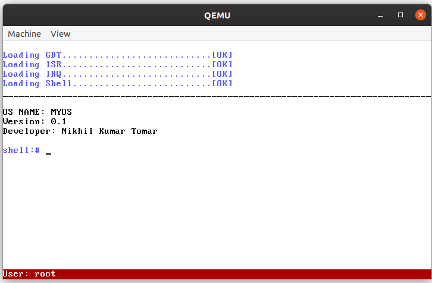

# Simple-Operating-System-from-Scratch
A simple operating system build from scratch using C and assembly language.
The code includes a make file that will help you to run this whole program.

|  |
| :--: |
| *Main window of the mini-operating system* |

## Requirements
1.  nasm
2.  gcc
3.  ld
4. qemu-system-x86_64

## Command to run
$ make all
